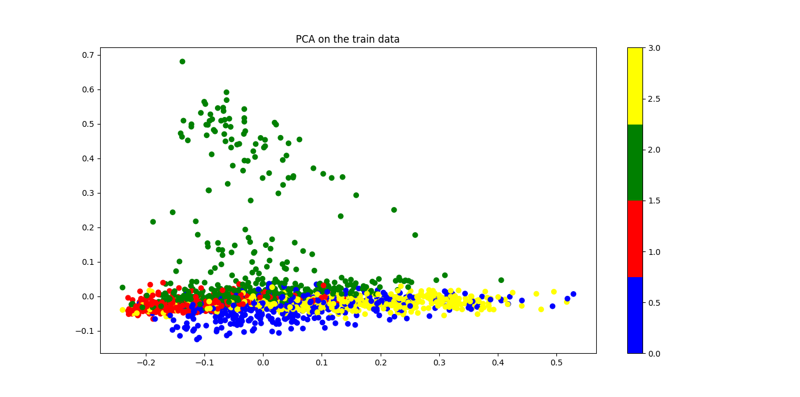
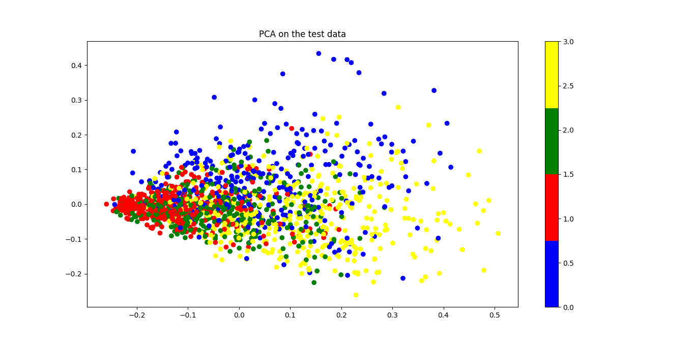
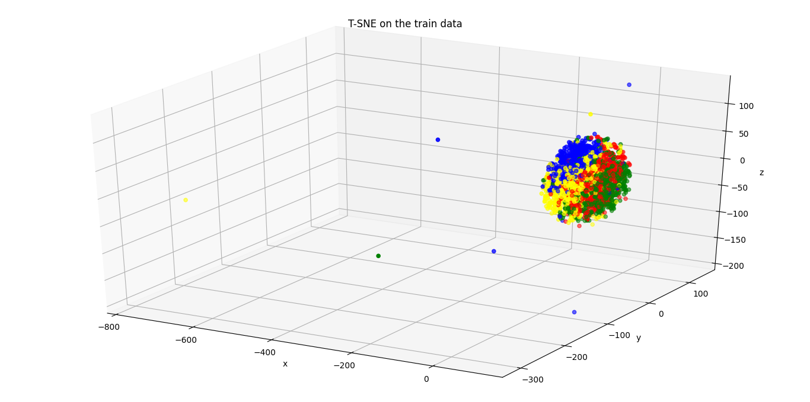
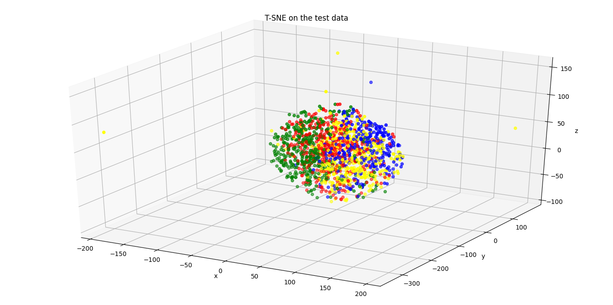
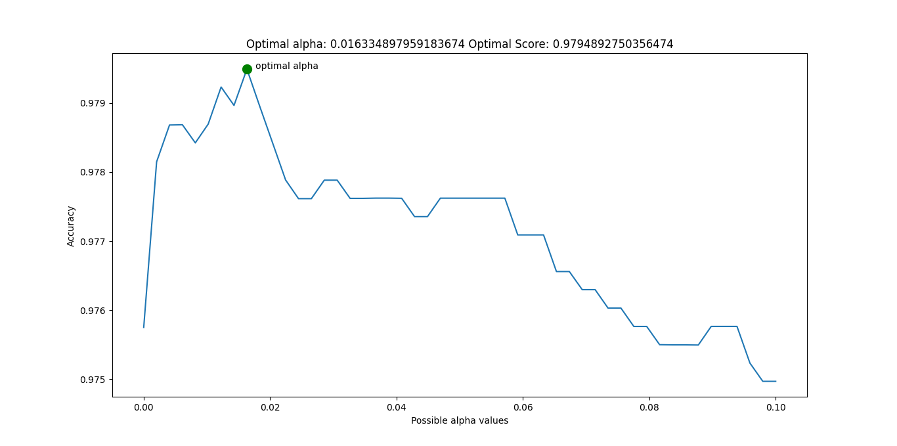
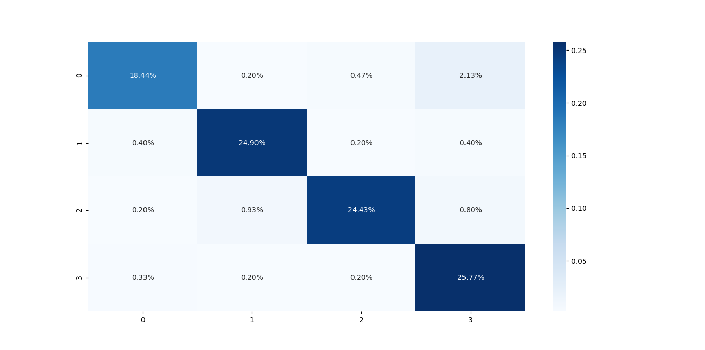

# Directory Structure
```text
.
├── api_test.py
├── app.py
├── data
│   └── NewsGroups-partial-train-embedding.txt
├── embeddings
│   └── tf-idf-h27ed.pkl
├── figures
│   ├── Figure_cm.png
│   ├── Figure_opt_alpha.png
│   ├── Figure_pca_test.png
│   ├── Figure_pca_train.png
│   ├── Figure_tsne_test.png
│   └── Figure_tsne_train.png
├── README.md
├── run.py
├── utils
│   ├── data.py
│   ├── embedding.py
│   ├── explore_embedding.py
│   ├── __init__.py
│   ├── model.py
│   └── plot.py
└── weights
    └── NaivBay-8a0li.pkl

5 directories, 19 files
```
# Command Line Interface
```text
usage: run.py [-h] [--load LOAD]

optional arguments:
  -h, --help   show this help message and exit
  --load LOAD  True: Load trained model False: Train model default: False
```

# Data
```text
Features: 20NewsGroups sentences
```
```text
Labels: 'alt.atheism', 'comp.graphics', 'sci.med', 'soc.religion.christian'
```

# Build TF-IDF Text Representation Model

### Exploration of the Tf-Idf Embeddings on the 3 sentence from 20NewsGroups Training Data
```text
for each sentence we build 
```
* Term-Frequency Vector
  * tf_sen_0
  * tf_sen_1
  * tf_sen_2

* InverseDocumentFrequency Vector
  * idf

* TermFrequency-InverseDocumentFrequency Vector
  * tf_idf_sen_0
  * tf_idf_sen_1
  * tf_idf_sen_2

|     | word          |   tf_sen_0 |   tf_sen_1 |   tf_sen_2 |     idf |   tf_idf_sen_0 |   tf_idf_sen_1 |   tf_idf_sen_2 |
|----:|:--------------|-----------:|-----------:|-----------:|--------:|---------------:|---------------:|---------------:|
|   0 | 2d            |          0 |          2 |          0 | 1.69315 |      0         |      0.130627  |      0         |
|   1 | 3d            |          0 |          1 |          0 | 1.69315 |      0         |      0.0653136 |      0         |
|   2 | about         |          0 |          0 |          1 | 1.69315 |      0         |      0         |      0.0276341 |
|   3 | accept        |          0 |          0 |          1 | 1.69315 |      0         |      0         |      0.0276341 |
|   4 | action        |          0 |          0 |          1 | 1.69315 |      0         |      0         |      0.0276341 |
|   5 | actions       |          0 |          0 |          1 | 1.69315 |      0         |      0         |      0.0276341 |
|   6 | advance       |          1 |          0 |          0 | 1.69315 |      0.155466  |      0         |      0         |
|   7 | affect        |          0 |          0 |          1 | 1.69315 |      0         |      0         |      0.0276341 |
|   8 | after         |          0 |          0 |          1 | 1.69315 |      0         |      0         |      0.0276341 |
|   9 | age           |          0 |          0 |          1 | 1.69315 |      0         |      0         |      0.0276341 |
|  10 | agency        |          0 |          0 |          1 | 1.69315 |      0         |      0         |      0.0276341 |
|  11 | algo          |          0 |          1 |          0 | 1.69315 |      0         |      0.0653136 |      0         |
|  12 | also          |          1 |          0 |          3 | 1.28768 |      0.118236  |      0         |      0.0630493 |
|  13 | an            |          0 |          0 |          2 | 1.69315 |      0         |      0         |      0.0552681 |
|  14 | and           |          0 |          0 |          8 | 1.69315 |      0         |      0         |      0.221073  |
|  15 | angry         |          0 |          0 |          1 | 1.69315 |      0         |      0         |      0.0276341 |
|  16 | ani           |          0 |          1 |          0 | 1.69315 |      0         |      0.0653136 |      0         |
|  17 | anxiety       |          0 |          0 |          1 | 1.69315 |      0         |      0         |      0.0276341 |
|  18 | any           |          1 |          3 |          1 | 1       |      0.0918207 |      0.115726  |      0.0163211 |
|  19 | anyone        |          1 |          0 |          0 | 1.69315 |      0.155466  |      0         |      0         |
|  20 | application   |          1 |          0 |          0 | 1.69315 |      0.155466  |      0         |      0         |
|  21 | apply         |          0 |          0 |          1 | 1.69315 |      0         |      0         |      0.0276341 |
|  22 | appreciated   |          0 |          1 |          0 | 1.69315 |      0         |      0.0653136 |      0         |
|  23 | are           |          0 |          0 |          6 | 1.69315 |      0         |      0         |      0.165804  |
|  24 | area          |          0 |          3 |          0 | 1.69315 |      0         |      0.195941  |      0         |
|  25 | as            |          0 |          1 |          0 | 1.69315 |      0         |      0.0653136 |      0         |
|  26 | at            |          0 |          0 |          1 | 1.69315 |      0         |      0         |      0.0276341 |
|  27 | attention     |          0 |          0 |          1 | 1.69315 |      0         |      0         |      0.0276341 |
|  28 | back          |          0 |          0 |          1 | 1.69315 |      0         |      0         |      0.0276341 |
|  29 | background    |          0 |          1 |          0 | 1.69315 |      0         |      0.0653136 |      0         |
|  30 | be            |          0 |          4 |          7 | 1.28768 |      0         |      0.198691  |      0.147115  |
|  31 | because       |          0 |          0 |          4 | 1.69315 |      0         |      0         |      0.110536  |
|  32 | being         |          0 |          0 |          2 | 1.69315 |      0         |      0         |      0.0552681 |
|  33 | believe       |          0 |          0 |          1 | 1.69315 |      0         |      0         |      0.0276341 |
|  34 | bezier        |          0 |          2 |          0 | 1.69315 |      0         |      0.130627  |      0         |
|  35 | body          |          0 |          1 |          0 | 1.69315 |      0         |      0.0653136 |      0         |
|  36 | boss          |          0 |          0 |          3 | 1.69315 |      0         |      0         |      0.0829022 |
|  37 | bounded       |          0 |          1 |          0 | 1.69315 |      0         |      0.0653136 |      0         |
|  38 | bring         |          0 |          0 |          3 | 1.69315 |      0         |      0         |      0.0829022 |
|  39 | broken        |          0 |          0 |          1 | 1.69315 |      0         |      0         |      0.0276341 |
|  40 | bully         |          0 |          0 |          1 | 1.69315 |      0         |      0         |      0.0276341 |
|  41 | but           |          0 |          0 |          1 | 1.69315 |      0         |      0         |      0.0276341 |
|  42 | by            |          0 |          1 |          0 | 1.69315 |      0         |      0.0653136 |      0         |
|  43 | can           |          0 |          2 |          4 | 1.28768 |      0         |      0.0993453 |      0.0840657 |
|  44 | car           |          0 |          0 |          1 | 1.69315 |      0         |      0         |      0.0276341 |
|  45 | cause         |          0 |          0 |          1 | 1.69315 |      0         |      0         |      0.0276341 |
|  46 | cell          |          0 |          1 |          0 | 1.69315 |      0         |      0.0653136 |      0         |
|  47 | cells         |          0 |          2 |          0 | 1.69315 |      0         |      0.130627  |      0         |
|  48 | center        |          0 |          0 |          1 | 1.69315 |      0         |      0         |      0.0276341 |
|  49 | check         |          0 |          0 |          1 | 1.69315 |      0         |      0         |      0.0276341 |
|  50 | closing       |          0 |          0 |          1 | 1.69315 |      0         |      0         |      0.0276341 |
|  51 | come          |          0 |          0 |          1 | 1.69315 |      0         |      0         |      0.0276341 |
|  52 | comforting    |          0 |          0 |          1 | 1.69315 |      0         |      0         |      0.0276341 |
|  53 | companies     |          0 |          0 |          1 | 1.69315 |      0         |      0         |      0.0276341 |
|  54 | company       |          0 |          0 |          2 | 1.69315 |      0         |      0         |      0.0552681 |
|  55 | computer      |          0 |          0 |          2 | 1.69315 |      0         |      0         |      0.0552681 |
|  56 | constant      |          0 |          0 |          1 | 1.69315 |      0         |      0         |      0.0276341 |
|  57 | convert       |          1 |          0 |          0 | 1.69315 |      0.155466  |      0         |      0         |
|  58 | converting    |          1 |          0 |          0 | 1.69315 |      0.155466  |      0         |      0         |
|  59 | correct       |          1 |          0 |          0 | 1.69315 |      0.155466  |      0         |      0         |
|  60 | curve         |          0 |          2 |          0 | 1.69315 |      0         |      0.130627  |      0         |
|  61 | deal          |          0 |          0 |          1 | 1.69315 |      0         |      0         |      0.0276341 |
|  62 | department    |          0 |          0 |          1 | 1.69315 |      0         |      0         |      0.0276341 |
|  63 | did           |          0 |          0 |          1 | 1.69315 |      0         |      0         |      0.0276341 |
|  64 | didn          |          0 |          0 |          2 | 1.69315 |      0         |      0         |      0.0552681 |
|  65 | discuss       |          0 |          0 |          3 | 1.69315 |      0         |      0         |      0.0829022 |
|  66 | do            |          1 |          0 |          4 | 1.28768 |      0.118236  |      0         |      0.0840657 |
|  67 | does          |          1 |          1 |          4 | 1       |      0.0918207 |      0.0385752 |      0.0652845 |
|  68 | doing         |          0 |          1 |          1 | 1.28768 |      0         |      0.0496726 |      0.0210164 |
|  69 | domain        |          0 |          2 |          0 | 1.69315 |      0         |      0.130627  |      0         |
|  70 | don           |          0 |          0 |          1 | 1.69315 |      0         |      0         |      0.0276341 |
|  71 | done          |          0 |          1 |          1 | 1.28768 |      0         |      0.0496726 |      0.0210164 |
|  72 | due           |          0 |          0 |          1 | 1.69315 |      0         |      0         |      0.0276341 |
|  73 | effectively   |          0 |          0 |          1 | 1.69315 |      0         |      0         |      0.0276341 |
|  74 | eight         |          0 |          0 |          1 | 1.69315 |      0         |      0         |      0.0276341 |
|  75 | else          |          0 |          1 |          0 | 1.69315 |      0         |      0.0653136 |      0         |
|  76 | email         |          1 |          0 |          1 | 1.28768 |      0.118236  |      0         |      0.0210164 |
|  77 | emotional     |          0 |          0 |          1 | 1.69315 |      0         |      0         |      0.0276341 |
|  78 | employee      |          0 |          0 |          1 | 1.69315 |      0         |      0         |      0.0276341 |
|  79 | employees     |          0 |          0 |          1 | 1.69315 |      0         |      0         |      0.0276341 |
|  80 | enjoy         |          0 |          0 |          1 | 1.69315 |      0         |      0         |      0.0276341 |
|  81 | enormous      |          0 |          0 |          1 | 1.69315 |      0         |      0         |      0.0276341 |
|  82 | entire        |          0 |          0 |          1 | 1.69315 |      0         |      0         |      0.0276341 |
|  83 | esteem        |          0 |          0 |          1 | 1.69315 |      0         |      0         |      0.0276341 |
|  84 | etc           |          0 |          0 |          4 | 1.69315 |      0         |      0         |      0.110536  |
|  85 | even          |          0 |          0 |          1 | 1.69315 |      0         |      0         |      0.0276341 |
|  86 | feel          |          0 |          0 |          1 | 1.69315 |      0         |      0         |      0.0276341 |
|  87 | feelings      |          0 |          0 |          1 | 1.69315 |      0         |      0         |      0.0276341 |
|  88 | fight         |          0 |          0 |          1 | 1.69315 |      0         |      0         |      0.0276341 |
|  89 | files         |          2 |          0 |          0 | 1.69315 |      0.310932  |      0         |      0         |
|  90 | find          |          0 |          0 |          1 | 1.69315 |      0         |      0         |      0.0276341 |
|  91 | for           |          0 |          2 |          3 | 1.28768 |      0         |      0.0993453 |      0.0630493 |
|  92 | format        |          1 |          0 |          0 | 1.69315 |      0.155466  |      0         |      0         |
|  93 | from          |          0 |          0 |          1 | 1.69315 |      0         |      0         |      0.0276341 |
|  94 | go            |          0 |          0 |          1 | 1.69315 |      0         |      0         |      0.0276341 |
|  95 | going         |          0 |          0 |          2 | 1.69315 |      0         |      0         |      0.0552681 |
|  96 | good          |          1 |          0 |          0 | 1.69315 |      0.155466  |      0         |      0         |
|  97 | great         |          0 |          0 |          1 | 1.69315 |      0         |      0         |      0.0276341 |
|  98 | gross         |          0 |          0 |          1 | 1.69315 |      0         |      0         |      0.0276341 |
|  99 | group         |          1 |          0 |          0 | 1.69315 |      0.155466  |      0         |      0         |
| 100 | gurus         |          0 |          1 |          0 | 1.69315 |      0         |      0.0653136 |      0         |
| 101 | had           |          0 |          1 |          1 | 1.28768 |      0         |      0.0496726 |      0.0210164 |
| 102 | happen        |          0 |          0 |          1 | 1.69315 |      0         |      0         |      0.0276341 |
| 103 | happens       |          0 |          0 |          1 | 1.69315 |      0         |      0         |      0.0276341 |
| 104 | harm          |          0 |          0 |          1 | 1.69315 |      0         |      0         |      0.0276341 |
| 105 | harrassment   |          0 |          0 |          1 | 1.69315 |      0         |      0         |      0.0276341 |
| 106 | has           |          0 |          1 |          1 | 1.28768 |      0         |      0.0496726 |      0.0210164 |
| 107 | hateful       |          0 |          0 |          1 | 1.69315 |      0         |      0         |      0.0276341 |
| 108 | have          |          0 |          2 |          1 | 1.28768 |      0         |      0.0993453 |      0.0210164 |
| 109 | he            |          0 |          0 |          1 | 1.69315 |      0         |      0         |      0.0276341 |
| 110 | healing       |          0 |          0 |          1 | 1.69315 |      0         |      0         |      0.0276341 |
| 111 | help          |          0 |          2 |          0 | 1.69315 |      0         |      0.130627  |      0         |
| 112 | hi            |          0 |          1 |          0 | 1.69315 |      0         |      0.0653136 |      0         |
| 113 | higher        |          0 |          0 |          3 | 1.69315 |      0         |      0         |      0.0829022 |
| 114 | hold          |          0 |          0 |          1 | 1.69315 |      0         |      0         |      0.0276341 |
| 115 | honest        |          0 |          0 |          1 | 1.69315 |      0         |      0         |      0.0276341 |
| 116 | hope          |          0 |          1 |          0 | 1.69315 |      0         |      0.0653136 |      0         |
| 117 | how           |          0 |          1 |          1 | 1.28768 |      0         |      0.0496726 |      0.0210164 |
| 118 | hp            |          1 |          0 |          0 | 1.69315 |      0.155466  |      0         |      0         |
| 119 | hpgl          |          1 |          0 |          0 | 1.69315 |      0.155466  |      0         |      0         |
| 120 | hurt          |          0 |          0 |          1 | 1.69315 |      0         |      0         |      0.0276341 |
| 121 | husband       |          0 |          0 |          1 | 1.69315 |      0         |      0         |      0.0276341 |
| 122 | hustle        |          0 |          0 |          1 | 1.69315 |      0         |      0         |      0.0276341 |
| 123 | if            |          0 |          1 |          6 | 1.28768 |      0         |      0.0496726 |      0.126099  |
| 124 | ignorant      |          0 |          0 |          1 | 1.69315 |      0         |      0         |      0.0276341 |
| 125 | ignore        |          0 |          0 |          1 | 1.69315 |      0         |      0         |      0.0276341 |
| 126 | ignored       |          0 |          0 |          1 | 1.69315 |      0         |      0         |      0.0276341 |
| 127 | iii           |          1 |          0 |          0 | 1.69315 |      0.155466  |      0         |      0         |
| 128 | imbecile      |          0 |          0 |          1 | 1.69315 |      0         |      0         |      0.0276341 |
| 129 | img           |          1 |          0 |          0 | 1.69315 |      0.155466  |      0         |      0         |
| 130 | in            |          1 |          2 |          3 | 1       |      0.0918207 |      0.0771505 |      0.0489634 |
| 131 | inconceivable |          0 |          0 |          1 | 1.69315 |      0         |      0         |      0.0276341 |
| 132 | indeed        |          0 |          0 |          1 | 1.69315 |      0         |      0         |      0.0276341 |
| 133 | individual    |          0 |          1 |          0 | 1.69315 |      0         |      0.0653136 |      0         |
| 134 | insensitive   |          0 |          0 |          1 | 1.69315 |      0         |      0         |      0.0276341 |
| 135 | insensitivity |          0 |          0 |          1 | 1.69315 |      0         |      0         |      0.0276341 |
| 136 | inside        |          0 |          2 |          0 | 1.69315 |      0         |      0.130627  |      0         |
| 137 | into          |          1 |          2 |          0 | 1.28768 |      0.118236  |      0.0993453 |      0         |
| 138 | is            |          1 |          9 |          4 | 1       |      0.0918207 |      0.347177  |      0.0652845 |
| 139 | it            |          0 |          2 |          8 | 1.28768 |      0         |      0.0993453 |      0.168131  |
| 140 | jobs          |          0 |          0 |          1 | 1.69315 |      0         |      0         |      0.0276341 |
| 141 | judgemental   |          0 |          0 |          1 | 1.69315 |      0         |      0         |      0.0276341 |
| 142 | keep          |          0 |          0 |          1 | 1.69315 |      0         |      0         |      0.0276341 |
| 143 | know          |          1 |          1 |          2 | 1       |      0.0918207 |      0.0385752 |      0.0326423 |
| 144 | laserjet      |          1 |          0 |          0 | 1.69315 |      0.155466  |      0         |      0         |
| 145 | laugh         |          0 |          0 |          1 | 1.69315 |      0         |      0         |      0.0276341 |
| 146 | lawyer        |          0 |          0 |          1 | 1.69315 |      0         |      0         |      0.0276341 |
| 147 | let           |          0 |          0 |          1 | 1.69315 |      0         |      0         |      0.0276341 |
| 148 | letter        |          0 |          0 |          1 | 1.69315 |      0         |      0         |      0.0276341 |
| 149 | like          |          1 |          0 |          0 | 1.69315 |      0.155466  |      0         |      0         |
| 150 | ll            |          0 |          0 |          2 | 1.69315 |      0         |      0         |      0.0552681 |
| 151 | loop          |          0 |          2 |          0 | 1.69315 |      0         |      0.130627  |      0         |
| 152 | lot           |          0 |          0 |          3 | 1.69315 |      0         |      0         |      0.0829022 |
| 153 | lunch         |          0 |          0 |          1 | 1.69315 |      0         |      0         |      0.0276341 |
| 154 | made          |          0 |          1 |          0 | 1.69315 |      0         |      0.0653136 |      0         |
| 155 | make          |          0 |          0 |          2 | 1.69315 |      0         |      0         |      0.0552681 |
| 156 | management    |          0 |          0 |          1 | 1.69315 |      0         |      0         |      0.0276341 |
| 157 | manager       |          0 |          0 |          1 | 1.69315 |      0         |      0         |      0.0276341 |
| 158 | mapping       |          0 |          1 |          0 | 1.69315 |      0         |      0.0653136 |      0         |
| 159 | may           |          0 |          0 |          4 | 1.69315 |      0         |      0         |      0.110536  |
| 160 | maybe         |          0 |          0 |          1 | 1.69315 |      0         |      0         |      0.0276341 |
| 161 | me            |          0 |          1 |          3 | 1.28768 |      0         |      0.0496726 |      0.0630493 |
| 162 | mesh          |          0 |          3 |          0 | 1.69315 |      0         |      0.195941  |      0         |
| 163 | michael       |          1 |          0 |          0 | 1.69315 |      0.155466  |      0         |      0         |
| 164 | miracle       |          0 |          0 |          1 | 1.69315 |      0         |      0         |      0.0276341 |
| 165 | more          |          0 |          0 |          1 | 1.69315 |      0         |      0         |      0.0276341 |
| 166 | most          |          0 |          0 |          1 | 1.69315 |      0         |      0         |      0.0276341 |
| 167 | much          |          0 |          0 |          1 | 1.69315 |      0         |      0         |      0.0276341 |
| 168 | my            |          0 |          1 |          1 | 1.28768 |      0         |      0.0496726 |      0.0210164 |
| 169 | need          |          0 |          0 |          1 | 1.69315 |      0         |      0         |      0.0276341 |
| 170 | normally      |          0 |          0 |          1 | 1.69315 |      0         |      0         |      0.0276341 |
| 171 | not           |          0 |          0 |          8 | 1.69315 |      0         |      0         |      0.221073  |
| 172 | notation      |          0 |          1 |          0 | 1.69315 |      0         |      0.0653136 |      0         |
| 173 | notice        |          0 |          0 |          1 | 1.69315 |      0         |      0         |      0.0276341 |
| 174 | of            |          1 |          6 |          8 | 1       |      0.0918207 |      0.231451  |      0.130569  |
| 175 | off           |          0 |          0 |          1 | 1.69315 |      0         |      0         |      0.0276341 |
| 176 | offices       |          0 |          0 |          1 | 1.69315 |      0         |      0         |      0.0276341 |
| 177 | often         |          0 |          0 |          1 | 1.69315 |      0         |      0         |      0.0276341 |
| 178 | once          |          0 |          0 |          1 | 1.69315 |      0         |      0         |      0.0276341 |
| 179 | opinions      |          0 |          0 |          1 | 1.69315 |      0         |      0         |      0.0276341 |
| 180 | or            |          0 |          1 |          3 | 1.28768 |      0         |      0.0496726 |      0.0630493 |
| 181 | other         |          0 |          0 |          1 | 1.69315 |      0         |      0         |      0.0276341 |
| 182 | our           |          0 |          0 |          1 | 1.69315 |      0         |      0         |      0.0276341 |
| 183 | out           |          0 |          0 |          1 | 1.69315 |      0         |      0         |      0.0276341 |
| 184 | output        |          0 |          1 |          0 | 1.69315 |      0         |      0.0653136 |      0         |
| 185 | paster        |          0 |          0 |          1 | 1.69315 |      0         |      0         |      0.0276341 |
| 186 | patch         |          0 |          1 |          0 | 1.69315 |      0         |      0.0653136 |      0         |
| 187 | paying        |          0 |          0 |          1 | 1.69315 |      0         |      0         |      0.0276341 |
| 188 | pc            |          1 |          0 |          0 | 1.69315 |      0.155466  |      0         |      0         |
| 189 | pd            |          1 |          0 |          0 | 1.69315 |      0.155466  |      0         |      0         |
| 190 | people        |          0 |          0 |          4 | 1.69315 |      0         |      0         |      0.110536  |
| 191 | perhaps       |          0 |          0 |          2 | 1.69315 |      0         |      0         |      0.0552681 |
| 192 | person        |          0 |          0 |          2 | 1.69315 |      0         |      0         |      0.0552681 |
| 193 | personnel     |          0 |          0 |          1 | 1.69315 |      0         |      0         |      0.0276341 |
| 194 | playground    |          0 |          0 |          1 | 1.69315 |      0         |      0         |      0.0276341 |
| 195 | please        |          1 |          0 |          1 | 1.28768 |      0.118236  |      0         |      0.0210164 |
| 196 | plotter       |          1 |          0 |          0 | 1.69315 |      0.155466  |      0         |      0         |
| 197 | post          |          0 |          0 |          1 | 1.69315 |      0         |      0         |      0.0276341 |
| 198 | preserving    |          0 |          0 |          1 | 1.69315 |      0         |      0         |      0.0276341 |
| 199 | priest        |          0 |          0 |          1 | 1.69315 |      0         |      0         |      0.0276341 |
| 200 | privacy       |          0 |          0 |          1 | 1.69315 |      0         |      0         |      0.0276341 |
| 201 | problem       |          0 |          3 |          2 | 1.28768 |      0         |      0.149018  |      0.0420328 |
| 202 | problems      |          0 |          0 |          2 | 1.69315 |      0         |      0         |      0.0552681 |
| 203 | realize       |          0 |          0 |          1 | 1.69315 |      0         |      0         |      0.0276341 |
| 204 | rectangular   |          0 |          1 |          0 | 1.69315 |      0         |      0.0653136 |      0         |
| 205 | rejected      |          0 |          1 |          0 | 1.69315 |      0         |      0.0653136 |      0         |
| 206 | remains       |          0 |          0 |          1 | 1.69315 |      0         |      0         |      0.0276341 |
| 207 | rendered      |          0 |          1 |          0 | 1.69315 |      0         |      0.0653136 |      0         |
| 208 | resource      |          0 |          0 |          1 | 1.69315 |      0         |      0         |      0.0276341 |
| 209 | response      |          1 |          0 |          0 | 1.69315 |      0.155466  |      0         |      0         |
| 210 | sake          |          0 |          1 |          0 | 1.69315 |      0         |      0.0653136 |      0         |
| 211 | same          |          1 |          0 |          0 | 1.69315 |      0.155466  |      0         |      0         |
| 212 | seeing        |          0 |          0 |          1 | 1.69315 |      0         |      0         |      0.0276341 |
| 213 | seem          |          0 |          0 |          3 | 1.69315 |      0         |      0         |      0.0829022 |
| 214 | segments      |          0 |          2 |          0 | 1.69315 |      0         |      0.130627  |      0         |
| 215 | seriously     |          0 |          0 |          1 | 1.69315 |      0         |      0         |      0.0276341 |
| 216 | set           |          0 |          1 |          0 | 1.69315 |      0         |      0.0653136 |      0         |
| 217 | sexual        |          0 |          0 |          1 | 1.69315 |      0         |      0         |      0.0276341 |
| 218 | she           |          0 |          0 |          1 | 1.69315 |      0         |      0         |      0.0276341 |
| 219 | should        |          0 |          0 |          2 | 1.69315 |      0         |      0         |      0.0552681 |
| 220 | signs         |          0 |          0 |          1 | 1.69315 |      0         |      0         |      0.0276341 |
| 221 | single        |          0 |          0 |          1 | 1.69315 |      0         |      0         |      0.0276341 |
| 222 | smaller       |          0 |          1 |          0 | 1.69315 |      0         |      0.0653136 |      0         |
| 223 | so            |          0 |          0 |          1 | 1.69315 |      0         |      0         |      0.0276341 |
| 224 | solve         |          0 |          1 |          0 | 1.69315 |      0         |      0.0653136 |      0         |
| 225 | some          |          0 |          1 |          0 | 1.69315 |      0         |      0.0653136 |      0         |
| 226 | someone       |          0 |          0 |          2 | 1.69315 |      0         |      0         |      0.0552681 |
| 227 | something     |          0 |          0 |          1 | 1.69315 |      0         |      0         |      0.0276341 |
| 228 | somewhere     |          0 |          1 |          0 | 1.69315 |      0         |      0.0653136 |      0         |
| 229 | split         |          0 |          1 |          0 | 1.69315 |      0         |      0.0653136 |      0         |
| 230 | standard      |          1 |          0 |          0 | 1.69315 |      0.155466  |      0         |      0         |
| 231 | state         |          0 |          0 |          1 | 1.69315 |      0         |      0         |      0.0276341 |
| 232 | still         |          0 |          0 |          1 | 1.69315 |      0         |      0         |      0.0276341 |
| 233 | stop          |          0 |          0 |          1 | 1.69315 |      0         |      0         |      0.0276341 |
| 234 | stress        |          0 |          0 |          1 | 1.69315 |      0         |      0         |      0.0276341 |
| 235 | strife        |          0 |          0 |          1 | 1.69315 |      0         |      0         |      0.0276341 |
| 236 | support       |          0 |          0 |          2 | 1.69315 |      0         |      0         |      0.0552681 |
| 237 | supportive    |          0 |          0 |          1 | 1.69315 |      0         |      0         |      0.0276341 |
| 238 | take          |          0 |          0 |          1 | 1.69315 |      0         |      0         |      0.0276341 |
| 239 | tend          |          0 |          0 |          2 | 1.69315 |      0         |      0         |      0.0552681 |
| 240 | tga           |          1 |          0 |          0 | 1.69315 |      0.155466  |      0         |      0         |
| 241 | than          |          0 |          0 |          1 | 1.69315 |      0         |      0         |      0.0276341 |
| 242 | thanks        |          1 |          1 |          0 | 1.28768 |      0.118236  |      0.0496726 |      0         |
| 243 | that          |          0 |          0 |          6 | 1.69315 |      0         |      0         |      0.165804  |
| 244 | the           |          2 |         11 |         13 | 1       |      0.183641  |      0.424328  |      0.212175  |
| 245 | their         |          0 |          0 |          1 | 1.69315 |      0         |      0         |      0.0276341 |
| 246 | then          |          0 |          1 |          1 | 1.28768 |      0         |      0.0496726 |      0.0210164 |
| 247 | there         |          0 |          1 |          1 | 1.28768 |      0         |      0.0496726 |      0.0210164 |
| 248 | these         |          0 |          0 |          1 | 1.69315 |      0         |      0         |      0.0276341 |
| 249 | they          |          0 |          0 |          8 | 1.69315 |      0         |      0         |      0.221073  |
| 250 | this          |          1 |          3 |         10 | 1       |      0.0918207 |      0.115726  |      0.163211  |
| 251 | thiss         |          0 |          1 |          0 | 1.69315 |      0         |      0.0653136 |      0         |
| 252 | through       |          0 |          0 |          1 | 1.69315 |      0         |      0         |      0.0276341 |
| 253 | tif           |          1 |          0 |          0 | 1.69315 |      0.155466  |      0         |      0         |
| 254 | to            |          3 |          2 |         21 | 1       |      0.275462  |      0.0771505 |      0.342744  |
| 255 | tolerated     |          0 |          0 |          1 | 1.69315 |      0         |      0         |      0.0276341 |
| 256 | trimming      |          0 |          4 |          0 | 1.69315 |      0         |      0.261254  |      0         |
| 257 | trivially     |          0 |          1 |          0 | 1.69315 |      0         |      0.0653136 |      0         |
| 258 | trying        |          0 |          0 |          1 | 1.69315 |      0         |      0         |      0.0276341 |
| 259 | turn          |          0 |          0 |          1 | 1.69315 |      0         |      0         |      0.0276341 |
| 260 | unclear       |          0 |          0 |          1 | 1.69315 |      0         |      0         |      0.0276341 |
| 261 | up            |          0 |          2 |          1 | 1.28768 |      0         |      0.0993453 |      0.0210164 |
| 262 | ups           |          0 |          0 |          1 | 1.69315 |      0         |      0         |      0.0276341 |
| 263 | utility       |          1 |          0 |          0 | 1.69315 |      0.155466  |      0         |      0         |
| 264 | uv            |          0 |          1 |          0 | 1.69315 |      0         |      0.0653136 |      0         |
| 265 | ve            |          0 |          0 |          1 | 1.69315 |      0         |      0         |      0.0276341 |
| 266 | want          |          0 |          0 |          4 | 1.69315 |      0         |      0         |      0.110536  |
| 267 | was           |          0 |          0 |          2 | 1.69315 |      0         |      0         |      0.0552681 |
| 268 | way           |          1 |          0 |          0 | 1.69315 |      0.155466  |      0         |      0         |
| 269 | we            |          1 |          0 |          2 | 1.28768 |      0.118236  |      0         |      0.0420328 |
| 270 | well          |          0 |          0 |          2 | 1.69315 |      0         |      0         |      0.0552681 |
| 271 | went          |          0 |          0 |          1 | 1.69315 |      0         |      0         |      0.0276341 |
| 272 | what          |          0 |          0 |          1 | 1.69315 |      0         |      0         |      0.0276341 |
| 273 | which         |          0 |          1 |          0 | 1.69315 |      0         |      0.0653136 |      0         |
| 274 | while         |          0 |          0 |          2 | 1.69315 |      0         |      0         |      0.0552681 |
| 275 | who           |          0 |          0 |          1 | 1.69315 |      0         |      0         |      0.0276341 |
| 276 | whole         |          0 |          1 |          0 | 1.69315 |      0         |      0.0653136 |      0         |
| 277 | wholly        |          0 |          1 |          0 | 1.69315 |      0         |      0.0653136 |      0         |
| 278 | why           |          0 |          0 |          1 | 1.69315 |      0         |      0         |      0.0276341 |
| 279 | will          |          0 |          0 |          4 | 1.69315 |      0         |      0         |      0.110536  |
| 280 | willing       |          0 |          0 |          1 | 1.69315 |      0         |      0         |      0.0276341 |
| 281 | wiser         |          0 |          0 |          1 | 1.69315 |      0         |      0         |      0.0276341 |
| 282 | with          |          0 |          0 |          6 | 1.69315 |      0         |      0         |      0.165804  |
| 283 | without       |          0 |          0 |          1 | 1.69315 |      0         |      0         |      0.0276341 |
| 284 | women         |          0 |          0 |          1 | 1.69315 |      0         |      0         |      0.0276341 |
| 285 | wonder        |          0 |          0 |          1 | 1.69315 |      0         |      0         |      0.0276341 |
| 286 | work          |          0 |          0 |          1 | 1.69315 |      0         |      0         |      0.0276341 |
| 287 | working       |          0 |          0 |          1 | 1.69315 |      0         |      0         |      0.0276341 |
| 288 | worthless     |          0 |          0 |          1 | 1.69315 |      0         |      0         |      0.0276341 |
| 289 | would         |          1 |          1 |          2 | 1       |      0.0918207 |      0.0385752 |      0.0326423 |
| 290 | years         |          0 |          0 |          1 | 1.69315 |      0         |      0         |      0.0276341 |
| 291 | you           |          0 |          0 |         13 | 1.69315 |      0         |      0         |      0.359243  |
| 292 | your          |          0 |          0 |          7 | 1.69315 |      0         |      0         |      0.193438  |

## Plot 20NewsGroups Train & Test Sentences to TD-IDF Embeddings with 2D PCA & 3D TSNE

### Train Sentences TF-IDF Embeddings to 2D PCA


### Test Sentences TF-IDF Embeddings to 2D PCA


### Train Sentences TF-IDF Embeddings to 3D TSNE


### Test Sentences TF-IDF Embeddings to 3D TSNE



# Build & Train & Test the Multinomial Naive Bayes model

# Train the MultinomialNB model
```shell
python run.py --load no
```
## Find optimal alpha parameter for MultinomialNB model with 10-Fold Cross-Validation



## Confusion Matrix


## Accuracy Score: 0.94

```text
Embedding saved at embeddings/tf-idf-h27ed.pkl
Do you want to save the model weight? yes
Model saved at weights/NaivBay-8a0li.pkl
```
# Test the MultinomialNB model

## Load TF-IDF Embedding & Load Trained Model
```shell
python run.py --load yes
```

## Prediction topic for some  sentences
```text
Test Sentence - Software Engineering is getting hotter and hotter nowdays
Prediction Topic - 'comp.graphics'
```
```text
Test Sentence - The Effect of Intracoronary Infusion of Autologous Bone Marrow-Derived Lineage-Negative Stem/Progenitor Cells on Remodeling of Post-Infarcted Heart in Patient with Acute Myocardial Infarction
Prediction Topic - 'sci.med'
```

```text
Test Sentence - They have encountered many arguments and much supposed evidence for the existence of God, but they have found all of it to be invalid or inconclusive.
Prediction Topic - 'soc.religion.christian'
```


# Docker for the MultinomialNB model

## Build the Docker image

You can build docker image by following:

```shell
docker-compose build
```

## Run Docker container

You can launch a container from the Docker image by following:

```shell
docker-compose up
```